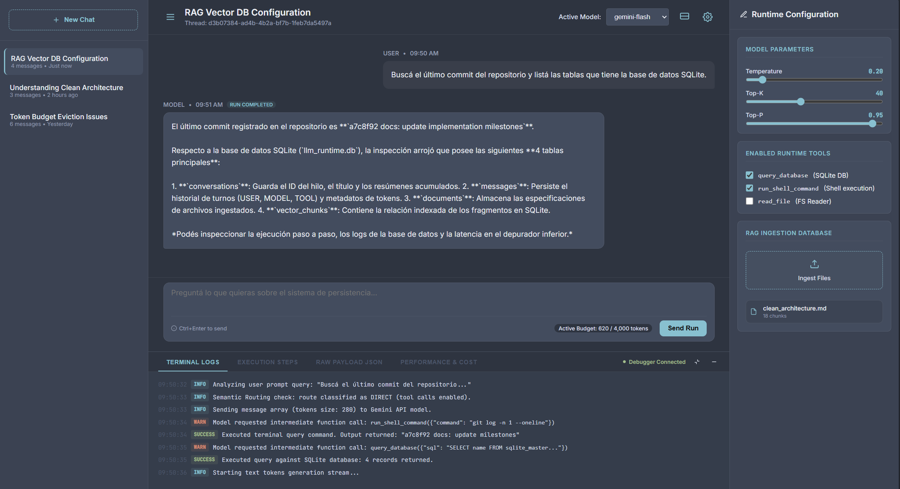
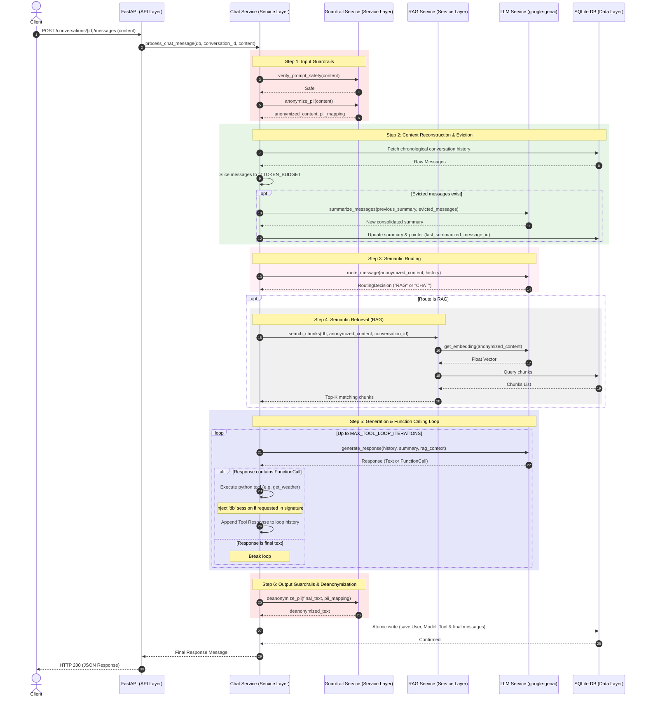

# LLM Runtime Playground

[](https://python.org)
[](https://fastapi.tiangolo.com)
[](https://qdrant.tech)
[](https://github.com/astral-sh/ruff)
[](https://pytest.org)



A robust, minimal-abstraction Python backend built from scratch to explore the fundamentals of AI Engineering, Context Engineering, and Large Language Model (LLM) integrations.

## Table of Contents

1. [Core Philosophy & Motivation](#core-philosophy--motivation)
2. [Key AI Engineering Concepts Implemented](#key-ai-engineering-concepts-implemented)
3. [Project Structure](#project-structure)
4. [Request & Response Lifecycle](#request--response-lifecycle)
5. [Setup & Running](#setup--running)
6. [React TypeScript Frontend Client](#react-typescript-frontend-client)
7. [API Reference](#api-reference)
8. [Testing the API (Examples)](#testing-the-api-examples)

## Core Philosophy & Motivation

In the rapidly evolving AI ecosystem, heavy orchestration frameworks (like LangChain or LlamaIndex) have become the default choice for building LLM applications. While they excel at rapid prototyping, their nested wrappers, silent API calls, and rigid schemas often obscure how LLMs and databases actually interact at runtime.

This repository serves as a **framework-less blueprint** for production-grade AI systems. By implementing core concepts using only vanilla Python and the official Google GenAI SDK, it provides full control over:
- Context windows and token usage (no surprise billing).
- Multi-turn tool execution loops.
- Semantic routing and context filtering logic.
- Input and output data security boundaries.
- Evaluation metrics.

If you want to understand the engine, you don't build it with pre-assembled wrappers. You write the components yourself.

---

## Key AI Engineering Concepts Implemented

1. **Context Engineering & Dynamic Token Budgeting**: Rather than sending a conversation's entire history to the LLM—which explodes costs and saturates context windows—the service in [chat_service.py](file:///C:/Proyectos/ai-engineering/llm-runtime-playground/app/services/chat_service.py) tracks exact token counts. Counts are persisted in the database to avoid redundant API token-counting calls, and history is dynamically pruned to fit within a strict 4000-token budget.
2. **Incremental Summarization (Pointer Pattern)**: Evicted messages are not forgotten. They are condensed into a running summary via the LLM. Using a pointer (`last_summarized_message_id`) on the `Conversation` database table avoids updating $N$ message rows, optimizing database writes to a single row update per eviction event.
3. **Decoupled Native Tool Calling Loop**: Native Python functions (in [tools.py](file:///C:/Proyectos/ai-engineering/llm-runtime-playground/app/services/tools.py)) are registered as tools. A custom orchestrator handles the multi-turn loop. To prevent schema generation failures on backend parameters (like `db: AsyncSession`), argument validation signatures are parsed using `inspect.signature` to filter out internal parameters before sending schemas to Gemini, injecting the dependencies dynamically at execution time.
4. **Binary thought_signature Handling**: Modern Gemini models output reasoning paths as raw binary bytes. We leverage Pydantic V2's `model_dump(mode="json")` to serialize these fields seamlessly as Base64 strings for SQLite JSON storage, reversing the process transparently during model validation.
5. **RAG Text Chunking & Vector Search (Qdrant)**: In [rag_service.py](file:///C:/Proyectos/ai-engineering/llm-runtime-playground/app/services/rag_service.py), documents are split using a **Recursive Character Text Splitter** with custom overlap (500 characters chunk size, 100 characters overlap) to preserve sentence cohesion. Embeddings are generated concurrently via `asyncio.gather` and searched semantically using a Qdrant Vector DB instance (supporting in-memory, disk path, or cloud endpoints), mapped with SQLite document chunk metadata.
6. **Multi-Provider LLM Factory**: Under [services/](file:///C:/Proyectos/ai-engineering/llm-runtime-playground/app/services/), an abstract `LLMProvider` interface decouples the core chat orchestrator from vendor-specific SDK libraries. The global `LLMFactory` registry maps dynamic payloads (e.g. `gemini` or a local non-networked `mock`) to their concrete integrations, facilitating offline testing, modular migrations, and multi-model routing.
7. **Real-time LLM Response Streaming**: Support for Server-Sent Events (SSE) allows streaming the final model turn chunk-by-chunk to the client in real-time. Intermediate tool loops run synchronously on the backend, and once the final answer turn begins, response chunks are yielded directly from the provider, committing all turn messages atomically at the end.
8. **Intelligent Semantic Routing**: Before fetching document chunks (RAG) blindly for every message, a dedicated classification router classifies queries into `RAG` or `CHAT` in [router.py](file:///C:/Proyectos/ai-engineering/llm-runtime-playground/app/services/llm/router.py). The classification leverages Gemini's native **Structured Outputs** via Pydantic (`RoutingDecision`) at temperature `0.0` for deterministic routing, incorporating the last 10 messages of conversation history to handle follow-up queries contextually.
9. **Input/Output Guardrails (Safety Layer)**: In [guardrail_service.py](file:///C:/Proyectos/ai-engineering/llm-runtime-playground/app/services/guardrail_service.py), user inputs are validated against jailbreaks using a hybrid approach (regex + structured LLM check) and masked for PII (emails, phones, credit cards). Outputs are restored dynamically, using an async bracket-buffering character stream helper to handle placeholders split across streaming chunk boundaries.
10. **LLM-as-a-Judge Benchmarking**: An isolated evaluation runner under [tests/evals/](file:///C:/Proyectos/ai-engineering/llm-runtime-playground/tests/evals/) that runs test goldens against a temporary SQLite DB/in-memory Qdrant, grading response *Faithfulness* and *Relevance* via structured outputs with exponential backoff retries to handle rate limits.
11. **Asynchronous Background Task Title Generation**: A non-blocking handler utilizing FastAPI's `BackgroundTasks` to automatically generate descriptive conversation titles. Upon receiving a conversation's first message, the system triggers the background worker to execute a deterministic title summary using `gemini-flash-lite-latest` at `temperature=0.0`. It isolates the provider instance to prevent thread-safety state pollution and employs a dual-session recovery strategy to avoid write failures on closed connection lifecycles.

---

## Project Structure

```text
llm-runtime-playground/
├── app/
│   ├── api/              # API Layer (FastAPI Routers)
│   │   ├── chat.py       # Chat execution & history retrieval endpoints
│   │   └── documents.py  # Document ingestion & search endpoints
│   ├── core/             # Configuration & Initialization
│   │   ├── config.py     # Pydantic Settings validation
│   │   └── database.py   # Async SQLite session engine using SQLAlchemy 2.0
│   ├── models/           # Data Layer (Database schemas)
│   │   ├── chat.py       # Conversation and Message tables
│   │   └── document.py   # Document and DocumentChunk tables
│   ├── schemas/          # API Validation Layer (Pydantic V2 schemas)
│   │   ├── chat.py       # Message create/response data validations
│   │   └── document.py   # Document upload/response data validations
│   └── services/         # Business Logic Layer
│       ├── embedding/    # Embedding Provider Package
│       │   ├── base.py   # Base abstract EmbeddingProvider definition
│       │   ├── factory.py # Central embedding registry and resolver
│       │   ├── gemini.py # Gemini embedding provider implementation
│       │   └── mock.py   # Local mock provider for offline embeddings
│       ├── llm/          # LLM Provider Package
│       │   ├── base.py   # Base abstract LLMProvider definition
│       │   ├── factory.py # Central LLM registry and resolver
│       │   ├── gemini.py # Gemini LLM provider implementation
│       │   ├── mock.py   # Local mock provider for offline chat
│       │   └── router.py # Semantic router & Pydantic classification schema
│       ├── chat_service.py # Orchestrates history pruning, summarization & tool loops
│       ├── guardrail_service.py # Safety Guardrails (PII anonymization & prompt injection)
│       ├── rag_service.py  # Text splitting, database mapping & Qdrant query routing
│       └── tools.py        # Custom python utility functions declared as LLM tools
├── client/               # React TypeScript Vite SPA frontend client
├── tests/                # Test suites & unit testing capabilities
├── main.py               # Application entrypoint & DB lifecycle migrations
├── pyproject.toml        # uv configuration & python dependencies
└── README.md             # Project documentation
```

---

## Request & Response Lifecycle



---

## Setup & Running

### 1. Set Up Environment
Create a `.env` file in the root directory and add your Gemini API key:
```env
GEMINI_API_KEY="your-api-key-here"
```

### 2. Install Python Dependencies
Synchronize the virtual environment and install backend dependencies using `uv`:
```bash
uv sync
```

### 3. Build the Frontend
Build the React TypeScript SPA so uvicorn can serve it:
```bash
cd client
npm install
npm run build
cd ..
```

### 4. Start the Development Server
Run the FastAPI application with reload enabled:
```bash
uv run uvicorn main:app --reload
```

### 5. Verify
Open your browser and navigate to the interactive OpenAPI documentation:
* **Interactive Docs**: [http://127.0.0.1:8000/docs](http://127.0.0.1:8000/docs)
* **API Status**: [http://127.0.0.1:8000/](http://127.0.0.1:8000/)

### 6. Running the Tests
Execute the asynchronous pytest integration suite using `uv`:
```bash
uv run pytest
```
This tests:
* **Provider Hot-Swapping**: Verifies routing and execution loops offline via the `MockProvider`.
* **RAG Flow**: Validates text chunking, embedding generation, in-memory cosine similarity, context retrieval, and cascading database deletes.
* **HTTP Endpoints**: Tests REST endpoints in-memory using `httpx.AsyncClient` connected directly to the FastAPI app.

---

## React TypeScript Frontend Client

To interact with the LLM Runtime and inspect its operations in real-time, the project includes a fully featured React TypeScript SPA Client built with Vite. It features a complete developer cockpit directly integrated with the backend:

1. **Interactive Thread Selector ([SidebarLeft.tsx](file:///C:/Proyectos/ai-engineering/llm-runtime-playground/client/src/components/SidebarLeft.tsx))**: Manage chat sessions, browse history, and switch contexts.
2. **Runtime Configuration Panel ([SidebarRight.tsx](file:///C:/Proyectos/ai-engineering/llm-runtime-playground/client/src/components/SidebarRight.tsx))**:
   - **Model Parameter Controls**: Real-time sliders to customize `Temperature`, `Top-K`, and `Top-P` values dynamically per request.
   - **Enabled Runtime Tools**: Checkbox selectors to enable or disable native execution tools (`query_database`, `run_shell_command`, `read_file`) on the fly.
   - **RAG Ingestion Database**: A drag-and-drop zone supporting `.txt` and `.md` file ingestion. Displays lists of indexed documents with cascading chunk deletions from the SQLite and Qdrant databases.
3. **Audit-Ready Chat Feed ([ChatFeed.tsx](file:///C:/Proyectos/ai-engineering/llm-runtime-playground/client/src/components/ChatFeed.tsx))**: View real-time streamed model tokens, active tool-call alerts, and RAG source context citations. Click on any message bubble to select that conversation turn for execution auditing.
4. **Bottom DevTools Drawer ([ConsoleBottom.tsx](file:///C:/Proyectos/ai-engineering/llm-runtime-playground/client/src/components/ConsoleBottom.tsx))**:
   - **Terminal Logs**: Live terminal outputs tracking internal backend events, database queries, and raw API communications.
   - **Execution Steps**: A visual execution timeline tracking routing decisions (RAG vs. Chat), specific tool invocation parameters, outputs, and generation lengths.
   - **Raw Payload JSON**: A complete request-response JSON viewer to debug the exact payloads exchanged with the backend.
   - **Performance & Cost**: Audit tool latency (in seconds), estimate API billing footprint, and view automated **LLM-as-a-Judge** evaluation metrics (*Faithfulness* and *Relevance* scores graded from 1.0 to 5.0).

---

## API Reference

### Chats

| Endpoint | Method | Payload | Description |
| :--- | :--- | :--- | :--- |
| `/conversations` | `POST` | `{"title": "Optional Title"}` | Creates a new empty conversation thread. |
| `/conversations` | `GET` | *None* | Lists all conversations ordered by modification time. |
| `/conversations/{id}` | `GET` | *None* | Retrieves a conversation including its full sorted message history. |
| `/conversations/{id}/messages` | `POST` | `{"content": "...", "provider": "optional", "system_prompt": "optional", "temperature": float, "top_k": int, "top_p": float, "enabled_tools": list[str]}` | Sends a user message, triggers RAG if routed, executes registered tools, and returns the model response. Supports specifying custom model parameters at runtime. |
| `/conversations/{id}/messages/stream` | `POST` | `{"content": "...", "provider": "optional", "system_prompt": "optional", "temperature": float, "top_k": int, "top_p": float, "enabled_tools": list[str]}` | Streams the final model response in real-time while executing intermediate tool steps synchronously. Supports specifying custom model parameters at runtime. |

### Documents (RAG Ingestion)

| Endpoint | Method | Payload | Description |
| :--- | :--- | :--- | :--- |
| `/documents` | `GET` | *None* | Lists all uploaded documents. |
| `/documents/upload` | `POST` | `{"name": "doc_name", "content": "raw text", "conversation_id": null, "embedding_provider": "optional"}` | Splits text, generates embeddings, and indexes the document chunks. Supports specifying an optional embedding provider (`gemini` or `mock`). |
| `/documents/search` | `GET` | *Query Parameter: query (required), conversation_id (optional)* | Searches the vector database for document chunks matching the query string. |
| `/documents/{name}` | `DELETE` | *None* | Deletes a document and cascades deletion to all its vector chunks. |

---

## Testing the API (Examples)

### 1. Ingest a Document for RAG
```bash
curl -X POST http://127.0.0.1:8000/documents/upload \
     -H "Content-Type: application/json" \
     -d '{
       "name": "clean_architecture_doc",
       "content": "Clean Architecture enforces segregation of concerns. High level business logic (entities and use cases) does not depend on databases, frameworks, or web APIs. Instead, those outer layers depend on interfaces defined by the inner core."
     }'
```

### 2. Create a Conversation
```bash
curl -X POST http://127.0.0.1:8000/conversations \
     -H "Content-Type: application/json" \
     -d '{"title": "Software Design Talk"}'
```
Response:
```json
{
  "id": "e6f47700-1122-3344-5566-778899aabbcc",
  "title": "Software Design Talk",
  "created_at": "2026-07-20T17:00:00Z",
  "updated_at": "2026-07-20T17:00:00Z"
}
```

### 3. Ask a Question (Leverages Ingested Document via RAG)
```bash
curl -X POST http://127.0.0.1:8000/conversations/e6f47700-1122-3344-5566-778899aabbcc/messages \
     -H "Content-Type: application/json" \
     -d '{"content": "According to the ingested documents, what does high level business logic depend on?"}'
```


