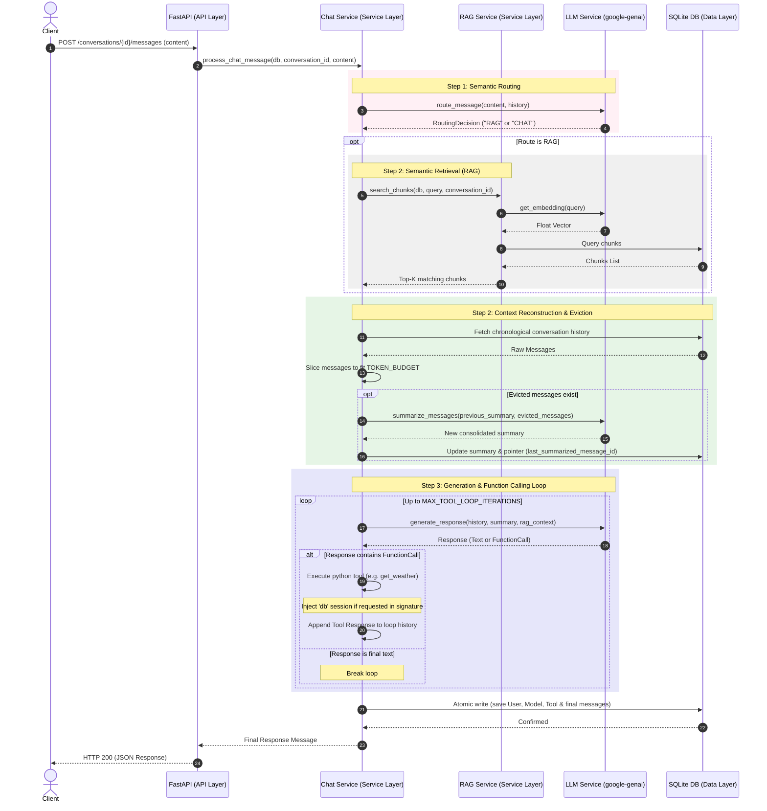

# LLM Runtime Playground

A robust, minimal-abstraction Python backend built from scratch to explore the fundamentals of AI Engineering, Context Engineering, and Large Language Model (LLM) integrations.

Instead of relying on heavy abstraction frameworks (like LangChain or LlamaIndex) that obscure backend operations, this repository implements the core components of a conversational AI system from the ground up using Clean Architecture principles, FastAPI, SQLAlchemy 2.0, and the official `google-genai` SDK.

---

## Key AI Engineering Concepts Implemented

1. **Context Engineering & Dynamic Token Budgeting**: Rather than sending a conversation's entire history to the LLM—which explodes costs and saturates context windows—the service in [chat_service.py](file:///C:/Proyectos/ai-engineering/llm-runtime-playground/app/services/chat_service.py) tracks exact token counts. Counts are persisted in the database to avoid redundant API token-counting calls, and history is dynamically pruned to fit within a strict 4000-token budget.
2. **Incremental Summarization (Pointer Pattern)**: Evicted messages are not forgotten. They are condensed into a running summary via the LLM. Using a pointer (`last_summarized_message_id`) on the `Conversation` database table avoids updating $N$ message rows, optimizing database writes to a single row update per eviction event.
3. **Decoupled Native Tool Calling Loop**: Native Python functions (in [tools.py](file:///C:/Proyectos/ai-engineering/llm-runtime-playground/app/services/tools.py)) are registered as tools. A custom orchestrator handles the multi-turn loop. To prevent schema generation failures on backend parameters (like `db: AsyncSession`), argument validation signatures are parsed using `inspect.signature` to filter out internal parameters before sending schemas to Gemini, injecting the dependencies dynamically at execution time.
4. **Binary thought_signature Handling**: Modern Gemini models output reasoning paths as raw binary bytes. We leverage Pydantic V2's `model_dump(mode="json")` to serialize these fields seamlessly as Base64 strings for SQLite JSON storage, reversing the process transparently during model validation.
5. **RAG Text Chunking & Vector Search (Qdrant)**: In [rag_service.py](file:///C:/Proyectos/ai-engineering/llm-runtime-playground/app/services/rag_service.py), documents are split using a **Recursive Character Text Splitter** with custom overlap (500 characters chunk size, 100 characters overlap) to preserve sentence cohesion. Embeddings are generated concurrently via `asyncio.gather` and searched semantically using a Qdrant Vector DB instance (supporting in-memory, disk path, or cloud endpoints), mapped with SQLite document chunk metadata.
6. **Multi-Provider LLM Factory**: Under [services/](file:///C:/Proyectos/ai-engineering/llm-runtime-playground/app/services/), an abstract `LLMProvider` interface decouples the core chat orchestrator from vendor-specific SDK libraries. The global `LLMFactory` registry maps dynamic payloads (e.g. `gemini` or a local non-networked `mock`) to their concrete integrations, facilitating offline testing, modular migrations, and multi-model routing.
7. **Real-time LLM Response Streaming**: Support for Server-Sent Events (SSE) allows streaming the final model turn chunk-by-chunk to the client in real-time. Intermediate tool loops run synchronously on the backend, and once the final answer turn begins, response chunks are yielded directly from the provider, committing all turn messages atomically at the end.
8. **Intelligent Semantic Routing**: Before fetching document chunks (RAG) blindly for every message, a dedicated classification router classifies queries into `RAG` or `CHAT` in [router.py](file:///C:/Proyectos/ai-engineering/llm-runtime-playground/app/services/llm/router.py). The classification leverages Gemini's native **Structured Outputs** via Pydantic (`RoutingDecision`) at temperature `0.0` for deterministic routing, incorporating the last 10 messages of conversation history to handle follow-up queries contextually.

---


## Project Structure

```text
llm-runtime-playground/
├── app/
│   ├── api/              # API Layer (FastAPI Routers)
│   │   ├── chat.py       # Chat execution & history retrieval endpoints
│   │   └── documents.py  # Document ingestion & search endpoints
│   ├── core/             # Configuration & Initialization
│   │   ├── config.py     # Pydantic Settings validation
│   │   └── database.py   # Async SQLite session engine using SQLAlchemy 2.0
│   ├── models/           # Data Layer (Database schemas)
│   │   └── chat.py       # Conversation, Message, Document, and Chunk tables
│   ├── schemas/          # API Validation Layer (Pydantic V2 schemas)
│   │   ├── chat.py       # Message create/response data validations
│   │   └── document.py   # Document upload/response data validations
│   └── services/         # Business Logic Layer
│       ├── embedding/    # Embedding Provider Package
│       │   ├── base.py   # Base abstract EmbeddingProvider definition
│       │   ├── factory.py # Central embedding registry and resolver
│       │   ├── gemini.py # Gemini embedding provider implementation
│       │   └── mock.py   # Local mock provider for offline embeddings
│       ├── llm/          # LLM Provider Package
│       │   ├── base.py   # Base abstract LLMProvider definition
│       │   ├── factory.py # Central LLM registry and resolver
│       │   ├── gemini.py # Gemini LLM provider implementation
│       │   ├── mock.py   # Local mock provider for offline chat
│       │   └── router.py # Semantic router & Pydantic classification schema
│       ├── chat_service.py # Orchestrates history pruning, summarization & tool loops

│       ├── rag_service.py  # Text splitting, database mapping & Qdrant query routing
│       └── tools.py        # Custom python utility functions declared as LLM tools
├── tests/                # Test suites & unit testing capabilities
├── main.py               # Application entrypoint & DB lifecycle migrations
├── pyproject.toml        # uv configuration & python dependencies
├── roadmap.md            # Future refactoring & code quality roadmap
└── README.md             # Project documentation
```

---

## Request & Response Lifecycle



---

## Setup & Running

### 1. Set Up Environment
Create a `.env` file in the root directory and add your Gemini API key:
```env
GEMINI_API_KEY="your-api-key-here"
```

### 2. Start the Development Server
Install dependencies and run the server using `uv`:
```bash
uv run uvicorn main:app --reload
```

### 3. Verify
Open your browser and navigate to the interactive OpenAPI documentation:
* **Interactive Docs**: [http://127.0.0.1:8000/docs](http://127.0.0.1:8000/docs)
* **API Status**: [http://127.0.0.1:8000/](http://127.0.0.1:8000/)

### 4. Running the Tests
Execute the asynchronous pytest integration suite using `uv`:
```bash
uv run pytest
```
This tests:
* **Provider Hot-Swapping**: Verifies routing and execution loops offline via the `MockProvider`.
* **RAG Flow**: Validates text chunking, embedding generation, in-memory cosine similarity, context retrieval, and cascading database deletes.
* **HTTP Endpoints**: Tests REST endpoints in-memory using `httpx.AsyncClient` connected directly to the FastAPI app.

---

## API Reference

### Chats

| Endpoint | Method | Payload | Description |
| :--- | :--- | :--- | :--- |
| `/conversations` | `POST` | `{"title": "Optional Title"}` | Creates a new empty conversation thread. |
| `/conversations/{id}` | `GET` | *None* | Retrieves a conversation including its full sorted message history. |
| `/conversations/{id}/messages` | `POST` | `{"content": "Your message", "provider": "optional"}` | Sends a message, executes retrieval, runs tool calling loop, and returns the response. Supports specifying the provider (`gemini` or `mock`). |
| `/conversations/{id}/messages/stream` | `POST` | `{"content": "Your message", "provider": "optional"}` | Streams the response chunks in real-time. |

### Documents (RAG Ingestion)

| Endpoint | Method | Payload | Description |
| :--- | :--- | :--- | :--- |
| `/documents` | `GET` | *None* | Lists all uploaded documents. |
| `/documents/upload` | `POST` | `{"name": "doc_name", "content": "raw text", "conversation_id": null}` | Splits text, generates embeddings, and indexes the document chunks. |
| `/documents/{name}` | `DELETE` | *None* | Deletes a document and cascades deletion to all its vector chunks. |

---

## Testing the API (Examples)

### 1. Ingest a Document for RAG
```bash
curl -X POST http://127.0.0.1:8000/documents/upload \
     -H "Content-Type: application/json" \
     -d '{
       "name": "clean_architecture_doc",
       "content": "Clean Architecture enforces segregation of concerns. High level business logic (entities and use cases) does not depend on databases, frameworks, or web APIs. Instead, those outer layers depend on interfaces defined by the inner core."
     }'
```

### 2. Create a Conversation
```bash
curl -X POST http://127.0.0.1:8000/conversations \
     -H "Content-Type: application/json" \
     -d '{"title": "Software Design Talk"}'
```
Response:
```json
{
  "id": "e6f47700-1122-3344-5566-778899aabbcc",
  "title": "Software Design Talk",
  "created_at": "2026-07-20T17:00:00Z",
  "updated_at": "2026-07-20T17:00:00Z"
}
```

### 3. Ask a Question (Leverages Ingested Document via RAG)
```bash
curl -X POST http://127.0.0.1:8000/conversations/e6f47700-1122-3344-5566-778899aabbcc/messages \
     -H "Content-Type: application/json" \
     -d '{"content": "According to the ingested documents, what does high level business logic depend on?"}'
```

